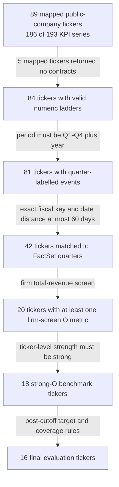
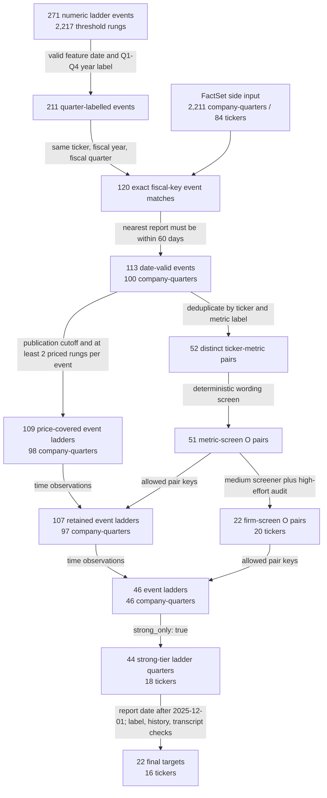

# Legacy Kalshi Raw-Ladder Benchmark

> Archived one-run Jihoon-main reproduction. The authoritative manuscript run is
> [`PAPER_RESULTS.md`](PAPER_RESULTS.md); counts and results below belong to the earlier frozen
> screen.

This is the authoritative design and result report for the Kalshi-only X substitution in the shared revenue-nowcasting paper framework.

## Benchmark contract

The benchmark contract is copied from Jihoon's latest `main` config. Only the X channel changes
from Carbon Arc data to Kalshi raw ladders.

| Component | Fixed rule |
|---|---|
| H (financial) | Up to 6 prior quarterly actuals, early consensus and realized surprise, plus target-quarter consensus |
| X (Kalshi) | Chronological raw pre-publication KPI ladders; all retained events, rungs and quote fields |
| Z (text) | Up to 2 most recent corrected earnings calls dated at least 31 days before report; one call is allowed when only one exists |
| Y | `surprise_early`, `surprise_print`, and `rev_yoy`, evaluated separately |
| Model | `gpt-5.5-2026-04-23`, `medium` reasoning |
| Variants | `BASE` and byte-identical `TOOL` prompt with optional lookups |
| Arms | `fin`, `fin+x`, `fin+text`, `fin+x+text` |
| Repeats | 1 independent call per arm and target |
| Knowledge guard | `REPORT_DATE > 2025-12-01` |
| Pairing | Every arm within a cell uses the exact same `ticker + FE_FP_END` rows |
| Seed | 2026 |

### Input, output and labels

The model outputs predicted total quarterly revenue in USD millions. The evaluator then derives:

- `surprise_early = (predicted revenue - early consensus) / early consensus`
- `surprise_print = (predicted revenue - last pre-report consensus) / last pre-report consensus`
- `rev_yoy = (predicted revenue - same-quarter prior-year actual) / prior-year actual`

The true labels apply the same formulas to FactSet actual revenue. Predictions and labels are scored
in percentage points. Structured output also contains confidence and rationale, but neither enters
the metrics.

### TOOL variant interface

`BASE` and `TOOL` render the same system and user prompt. `BASE` exposes no functions. `TOOL`
exposes the following two strict, no-argument functions to every arm:

| Tool | Explicit model input | Context bound by the runner | Plain-text output |
|---|---|---|---|
| `get_company_profile` | `{}` | Current target ticker | Frozen FMP company description: business model, sector and revenue drivers |
| `get_alt_data_description` | `{}` | Active `kalshi` channel | Frozen description of the Kalshi universe, pre-publication snapshot and ladder construction |

The model does not choose or pass the ticker. The runner binds `target.ticker` and the active channel
before dispatch. A tool round therefore has this shape:

```text
same BASE prompt + two function schemas
    -> model emits get_company_profile({}) or get_alt_data_description({})
    -> runner reads the target-bound string from kalshi/data/tool_context.json
    -> model receives the string and returns the structured revenue prediction
```

The tools do not return a Kalshi ladder, financial history, target-quarter actual, label, or live
search result. Raw ladder values are supplied directly in the prompt only for arms containing X.
The local context contains 20 company profiles fetched once
from Financial Modeling Prep stable/profile at `2026-07-22T13:28:07+00:00` plus one repository
methodology description. "Frozen" means reproducible after retrieval; the FMP profile is not a
historical point-in-time profile as of each target report.

The model and prompt text remain fixed across variants, but the transport path is not identical:
`BASE` uses Chat Completions structured parse, while `TOOL` uses the Responses API because the
configured model does not accept reasoning plus function tools on the Chat Completions path.

## Data universe

The crawl uses Kalshi's public Trade API v2 `/series?tags=KPIs` cursor pagination, then fetches both
current and historical markets for every returned series. The inventory is complete for the API
response captured by this run; explicit issuer aliases map public companies. The seven deliberately
unmapped series are non-public or non-company questions (Waymo, OpenAI/LLM rankings, subway
ridership and aggregate EV share).

### Counting units

- **Series:** a recurring Kalshi market template, such as quarterly Tesla deliveries.
- **Contract / rung:** one binary threshold market inside an event, such as
  `P(deliveries > 400,000)`.
- **Event / ladder:** one KPI for one stated period, containing at least two threshold rungs.
- **Pair:** one distinct `(ticker, metric_label)` eligibility rule with no time dimension.
- **Company-quarter:** one `(ticker, FE_FP_END)` observation. It can contain more than one event.
- **Target:** a company-quarter that also passes the final model-evaluation rules.

Counts only form a conventional funnel while the unit is unchanged. In particular, pair counts
cannot be compared directly with quarter counts: one retained pair can recur across many quarters.

### Ticker funnel



### Observation and pair flow



The FactSet panel is a side input to the fiscal join, not another Kalshi attrition stage. It contains
2,211 revenue company-quarters for 84 FactSet IDs, with actuals and
point-in-time consensus from FE_V4.

### Exact filter rules

1. **Issuer and market availability.** Of 193 KPI-tagged series, 186 map to
   89 public-company tickers. Current and historical market pages
   return 2,254 contracts across 281 events; restricting to
   mapped issuers leaves 2,238 contracts across 276 events and
   84 tickers. The mapped tickers with no returned
   contracts are `2330, DKNG, HLT, RKLB, V`.
2. **Numeric ladder validity.** A contract survives only when its YES side means `above` or
   `at least`, its numeric strike parses, and its `market_ticker` is unique. An event survives only
   with at least two such rungs. This removes 5 mapped events
   and leaves 271 events / 2,217 rungs.
3. **Quarter identity.** `period_label` must fully match `Q[1-4] YYYY`, and `feature_date` must parse.
   `feature_date` is the earliest available occurrence, close, or expiration timestamp. Of the
   60 events removed here, 46 have no period,
   14 are annual-only or otherwise non-quarter labels, and
   0 have a quarter label but no parseable date. This leaves
   211 events. The event then needs the same ticker, fiscal year, and fiscal
   quarter in FactSet: 120 events pass and
   91 do not. If more than one FactSet row is possible,
   the nearest report is selected, and absolute `feature_date - REPORT_DATE` must be <=60 days;
   7 more events fail that tolerance, leaving 113 events
   / 100 company-quarters.
4. **Leakage-safe price coverage.** The quote cutoff is `published_at - 1 minute`. A rung's market
   must already be open, and the latest daily candle between market open and cutoff must have a
   usable probability. A valid YES book with spread <=0.20 uses its midpoint; otherwise the code
   falls back to last trade, then previous trade. Each event still needs at least two priced rungs,
   and each quarter needs at least one surviving event. This leaves
   109 events / 98 quarters /
   746 rungs. The uncovered quarters are
   `SOFI 2024-03-31`, `HOOD 2025-09-30`.
5. **Metric wording screen.** The key is `(ticker, metric_label)`, so repeated quarters collapse to
   one pair. Employee/headcount metrics are X. Sold units, deliveries, volume, orders, trips,
   subscribers, bookings, passengers and similar revenue bases are O-strong. Accounts and
   engagement are O-moderate; an unmatched KPI defaults to O-moderate. The result is
   51 O and 1 X pair out of 52.
   The only X pair in this run is `META / headcount`, covering 2
   matched events.
   Applying those keys changes the time panel from 98 to 97
   quarters and from 109 to
   107 event ladders.
6. **Firm total-revenue screen.** The 51 O pairs enter `gpt-5.5-2026-04-23` at medium
   effort in validated batches of eight, followed by an adversarial high-effort audit. O requires
   a dominant, clean driver of the firm's total revenue. X covers a minority segment, an indirect
   or wrong measure, or a metric redundant with a cleaner one. This retains 22
   pairs and rejects 29; applying them leaves 46
   company-quarters across 20 tickers. As in the committed Carbon Arc screen, the
   largest clean driver can remain O around 20-45% of revenue; there is no hard 50% threshold.
7. **Primary strong tier.** `strength` is confidence in the O/X verdict, not estimated revenue
   share. The ticker-level screen takes the highest-confidence O verdict per ticker, and
   `strong_only: true` keeps 18 strong tickers / 44 ladder quarters.
   `DPZ` and `MTN` are O-moderate and are excluded.
8. **Evaluation target.** A target must have `REPORT_DATE > 2025-12-01`, a target-quarter
   ladder payload, a non-missing active Y, at least three strictly prior financial quarters, and at
   least one readable corrected earnings call dated no later than report minus 31 days. Up to six
   financial quarters and two calls are shown; the second call is optional. The date guard reduces
   44 strong-tier ladder quarters to 22. The later label,
   history, and transcript checks remove 0 additional rows, leaving
   22 matched targets across 16 tickers.

The deterministic metric screen uses the following ordered map; first match wins. The exact source
of truth is `kalshi/scripts/auto/s_ap_kalshi_revenue_screen.py`.

| Result | Matching metric wording |
|---|---|
| X | `headcount`, `employees`, `staff`, `workforce` |
| O-strong | deliveries/production/unit sales/shipments/vehicles; volume; orders/trips/rides; subscribers/payers/memberships; bookings/nights/passengers/seats/fares/rooms/homes/skier visits/restaurants/stores |
| O-moderate | gold subscribers, funded accounts/accounts; users, MAU/DAU, unique users, hours, streaming, engagement |
| O-moderate | no listed wording matches (default) |

The cutoff does not delete older Kalshi or financial observations. It only prevents them from
becoming evaluation Y rows; eligible earlier observations can still appear as H or prior-X context.

### Final evaluation contraction

| Step | Company-quarters | Tickers | Removed at this step |
|---|---:|---:|---|
| Firm-screen O panel | 46 | 20 | Starting time panel after pair filters |
| `strong_only: true` | 44 | 18 | 2 quarters: `DPZ`, `MTN` |
| `REPORT_DATE > 2025-12-01` | 22 | 16 | 22 pre-cutoff quarters; `NFLX`, `SPOT` lose all target rows |
| Label, history and transcript coverage | 22 | 16 | 0 additional quarters |

### Why pairs and quarters differ

The firm screen makes one keep/drop decision per `(ticker, metric_label)` and reuses that decision
at every date. For example, the TSLA deliveries metric is one pair-level decision but occurs in nine
matched quarterly events. There are 22 pairs but 20 tickers because BA
has `deliveries` and `commercial deliveries`, while COIN has `coinbase volume` and
`total trading volume`. Consequently, those 22 pair definitions expand to
46 retained company-quarter observations. After firm screening, this run has one
retained event ladder per retained company-quarter.

**84 numeric-ladder candidates:** AAPL, ABNB, ACDVF, AMZN, ATZ, BA, BULL, CAVA, CCL, CDNTF, CMG, COIN, COST, CVNA, DASH, DIS, DLMAF, DPZ, EBAY, F, FDX, FIG, FSLR, FUTU, GOOGL, GRAB, HD, HIMS, HOOD, INTC, KLAR, L, LOW, LULU, LUV, LYFT, MAR, MCD, MELI, META, MO, MTCH, MTN, NCLH, NFLX, NU, NVDA, NYT, ORCL, PETR4, PLNT, PLTR, PM, PSKY, RACE, RBLX, RDDT, RIVN, ROKU, SBUX, SCHW, SE, SG, SHOP, SNAP, SNOW, SOFI, SPOT, STZ, TGT, TLN, TOL, TOST, TSLA, UAL, UBER, ULTA, URBN, WEN, WH, WING, WMT, YOU, ZETA.

**42 exact-joined candidates:** ABNB, BA, BULL, CAVA, CCL, COIN, CVNA, DASH, DIS, DPZ, FUTU, HIMS, HOOD, KLAR, LUV, LYFT, MAR, META, MO, MTCH, MTN, NFLX, NYT, PLNT, PLTR, PM, PSKY, RACE, RBLX, RDDT, ROKU, SCHW, SNOW, SOFI, SPOT, STZ, TOL, TSLA, UAL, UBER, URBN, WH.

**20 firm-screen O tickers:** ABNB, BA, COIN, CVNA, DASH, DPZ, HIMS, LYFT, MO, MTCH, MTN, NFLX, PLNT, RACE, SPOT, STZ, TOL, TSLA, UAL, UBER.

**18 strong-O candidates:** ABNB, BA, COIN, CVNA, DASH, HIMS, LYFT, MO, MTCH, NFLX, PLNT, RACE, SPOT, STZ, TOL, TSLA, UAL, UBER.

**16 final benchmark tickers:** ABNB, BA, COIN, CVNA, DASH, HIMS, LYFT, MO, MTCH, PLNT, RACE, STZ, TOL, TSLA, UAL, UBER.

At the ticker level, the largest reductions are 84 ->
42 at the quarter/FactSet match and 42 ->
20 at the firm revenue-driver screen. `NFLX` and `SPOT` survive the strong screen but have
no ladder report after the knowledge cutoff, producing the final 18 -> 16
ticker change.

### Final ticker-quarters

All three Y definitions use the same 22 target rows.

- **H quarters shown:** number of prior financial quarters included in the prompt, capped at six;
  the target quarter is not counted.
- **Prior X ladder quarters shown:** number of those prior quarters that also include an eligible
  Kalshi ladder; the target-quarter ladder is not counted.
- **Prior calls:** number of corrected earnings-call transcripts supplied to text arms, capped at
  two and restricted to calls dated at least 31 days before the target report.

| Ticker | Target fiscal quarters | Targets | H quarters shown | Prior X ladder quarters shown | Prior calls |
|---|---|---:|---|---|---|
| ABNB | 2026-03-31 | 1 | 6 | 0 | 2 |
| BA | 2025-12-31, 2026-03-31 | 2 | 6, 6 | 0, 1 | 1, 2 |
| COIN | 2026-03-31 | 1 | 6 | 5 | 2 |
| CVNA | 2026-03-31 | 1 | 6 | 0 | 2 |
| DASH | 2025-12-31, 2026-03-31 | 2 | 6, 6 | 0, 1 | 2, 2 |
| HIMS | 2026-03-31 | 1 | 6 | 0 | 2 |
| LYFT | 2026-03-31 | 1 | 6 | 0 | 2 |
| MO | 2026-03-31 | 1 | 6 | 0 | 2 |
| MTCH | 2025-12-31, 2026-03-31 | 2 | 6, 6 | 0, 1 | 2, 2 |
| PLNT | 2026-03-31 | 1 | 6 | 0 | 2 |
| RACE | 2026-03-31 | 1 | 6 | 0 | 2 |
| STZ | 2026-05-31 | 1 | 6 | 0 | 2 |
| TOL | 2026-04-30 | 1 | 6 | 0 | 2 |
| TSLA | 2025-12-31, 2026-03-31 | 2 | 6, 6 | 6, 6 | 1, 2 |
| UAL | 2026-03-31, 2026-06-30 | 2 | 6, 6 | 0, 1 | 2, 2 |
| UBER | 2025-12-31, 2026-03-31 | 2 | 6, 6 | 0, 1 | 2, 2 |

## Kalshi X construction

For each company-quarter, every eligible KPI event is retained. Each event is an ordered ladder of
binary threshold contracts (rungs), such as `P(deliveries >= 300,000)`. The prompt places any prior
quarter ladder immediately after that quarter's financial row, then places the target-quarter ladder
after the target row.

For each rung, the information cutoff is one minute before the FactSet publication timestamp. The
collector searches from the contract's actual `open_time` through that cutoff and selects the latest
available daily candle. There is no 45-day quote-age cap; 45 days belonged to Carbon Arc's monthly
observation-to-quarter matching rule and is not a Kalshi market rule.

A valid YES bid/ask with spread <= 0.20 uses the midpoint. Invalid or wider books, including
`bid=0, ask=1`, fall back to last trade and then previous trade. The LLM receives condition,
probability, price source, bid, ask, last, previous, spread, candle timestamp, daily volume and open
interest for every rung. It receives no settled result, smoothing, interpolation or implied scalar.

## Evaluation

- **RMSE:** square root of mean squared percentage-point error; lower is better.
- **OOS R2:** `1 - SSE/SST` against the post-cutoff truth mean; higher is better.
- **Calibrated R2 (OOF):** company-held-out five-fold linear rescaling, fit only on other firms.
- **Correlation:** Pearson correlation between prediction and truth.
- **Synergy:** company-clustered bootstrap of `M(fin+x+text) - [M(fin+x) + M(fin+text) - M(fin)]`
  for correlation and MSE skill. Positive values indicate super-additivity; a 95% interval crossing
  zero is not statistically robust.
- **Shuffle-company surrogate:** the benchmark's company-block reassignment of Y. It tests whether
  the combined prediction tracks firm-specific outcomes rather than a common scale effect; it does
  not prove that Kalshi X itself is firm-specific and is not an X-shuffle test.

### Why classical baselines are N/A

The Carbon Arc baseline family assumes one comparable scalar `x_yoy` for every company-quarter.
Kalshi X is instead preserved as a variable-length `x_payload` containing raw
`(threshold, probability)` rungs. KPI units, thresholds and rung counts differ across companies and
quarters, so this benchmark does not define `x_abs`, `x_yoy`, or `x_yoy_3m`; those scalar fields are
set to missing by construction.

Baseline feature definitions:

- `x_yoy`: scalar alternative-data year-over-year growth.
- `sent`: Loughran-McDonald sentiment from the most recent eligible prior call.
- `lag_y`: one-quarter lag of the active Y.
- `x_sent`: `x_yoy * sent`.

| Baseline | Estimator and features | Status | Exact reason |
|---|---|---|---|
| N0 | Company historical mean | Available | Does not use X |
| N1 | OLS: `x_yoy` | N/A | `x_yoy` is undefined for a raw ladder |
| N2 | OLS: `sent` | Available | Does not use X |
| N3 | OLS: `x_yoy`, `sent` | N/A | Requires undefined `x_yoy` |
| N4 | OLS: `x_yoy`, `sent`, `x_sent` | N/A | Requires undefined `x_yoy` and its interaction |
| N3b | OLS: `x_yoy`, `sent`, `lag_y` | N/A | `sent` and `lag_y` exist, but `x_yoy` does not |
| N4b | OLS: `x_yoy`, `sent`, `lag_y`, `x_sent` | N/A | Requires undefined `x_yoy` and its interaction |
| N5 | Gradient-boosted trees: `x_yoy`, `sent`, `lag_y` | N/A | Its feature matrix requires undefined `x_yoy` |

For a ladder channel, the evaluator skips any baseline whose feature list contains `x_yoy` and
marks it unavailable before fitting. N/A therefore means **not applicable under the raw-ladder
representation**. It does not mean API failure, insufficient sample size, failed convergence, or
missing target rows. Replacing missing `x_yoy` with zero would falsely encode zero KPI growth and
collapse economically different ladders to the same value.

Producing numeric N1/N3/N4/N3b/N4b/N5 results would require a pre-specified ladder-to-scalar
transformation, followed by a comparable within-company or within-metric YoY calculation. That
would be a separate scalarized-Kalshi experiment, not this raw-ladder benchmark.

## Results

### Early-consensus revenue surprise / BASE

Matched sample: 22 company-quarters / 16 firms.

| Model | RMSE | OOS R2 | Calib. R2 (OOF) | Corr | MAE | Sign |
|---|---:|---:|---:|---:|---:|---:|
| fin | 3.588 | +0.316 | +0.187 | +0.577 | 2.490 | 0.591 |
| fin+x | 3.507 | +0.346 | +0.279 | +0.608 | 2.494 | 0.591 |
| fin+text | 3.490 | +0.353 | +0.166 | +0.628 | 2.374 | 0.727 |
| fin+x+text | 3.406 | +0.383 | +0.194 | +0.650 | 2.195 | 0.682 |
| N0 | 5.997 | -0.911 | - | -0.298 | 3.952 | 0.591 |
| N1 | N/A | N/A | N/A | N/A | N/A | N/A |
| N2 | 4.377 | -0.018 | - | -0.178 | 2.974 | 0.727 |
| N3 | N/A | N/A | N/A | N/A | N/A | N/A |
| N4 | N/A | N/A | N/A | N/A | N/A | N/A |
| N3b | N/A | N/A | N/A | N/A | N/A | N/A |
| N4b | N/A | N/A | N/A | N/A | N/A | N/A |
| N5 | N/A | N/A | N/A | N/A | N/A | N/A |

Descriptive RMSE delta X over H: -0.080 pp; X over H+Z: -0.084 pp (negative favors Kalshi).

| Bootstrap quantity | Mean | 95% CI | p(value <= 0) |
|---|---:|---:|---:|
| Corr synergy | -0.016 | [-0.195, +0.150] | 0.568 |
| MSE-skill synergy | -0.021 | [-0.320, +0.174] | 0.517 |

Shuffle-company surrogate p-value: 0.0250.

### Early-consensus revenue surprise / TOOL

Matched sample: 22 company-quarters / 16 firms.

| Model | RMSE | OOS R2 | Calib. R2 (OOF) | Corr | MAE | Sign |
|---|---:|---:|---:|---:|---:|---:|
| fin | 4.146 | +0.087 | -0.080 | +0.342 | 2.475 | 0.636 |
| fin+x | 3.656 | +0.290 | +0.233 | +0.586 | 2.663 | 0.591 |
| fin+text | 3.563 | +0.325 | +0.084 | +0.588 | 2.392 | 0.727 |
| fin+x+text | 3.487 | +0.354 | +0.146 | +0.615 | 2.415 | 0.682 |
| N0 | 5.997 | -0.911 | - | -0.298 | 3.952 | 0.591 |
| N1 | N/A | N/A | N/A | N/A | N/A | N/A |
| N2 | 4.377 | -0.018 | - | -0.178 | 2.974 | 0.727 |
| N3 | N/A | N/A | N/A | N/A | N/A | N/A |
| N4 | N/A | N/A | N/A | N/A | N/A | N/A |
| N3b | N/A | N/A | N/A | N/A | N/A | N/A |
| N4b | N/A | N/A | N/A | N/A | N/A | N/A |
| N5 | N/A | N/A | N/A | N/A | N/A | N/A |

Descriptive RMSE delta X over H: -0.490 pp; X over H+Z: -0.076 pp (negative favors Kalshi).

| Bootstrap quantity | Mean | 95% CI | p(value <= 0) |
|---|---:|---:|---:|
| Corr synergy | -0.204 | [-0.820, +0.320] | 0.701 |
| MSE-skill synergy | -0.146 | [-0.580, +0.256] | 0.684 |

Shuffle-company surrogate p-value: 0.0258.

TOOL telemetry: 88/88 arm requests used at least one lookup; calls: get_alt_data_description=88, get_company_profile=88.

### Pre-report-consensus revenue surprise / BASE

Matched sample: 22 company-quarters / 16 firms.

| Model | RMSE | OOS R2 | Calib. R2 (OOF) | Corr | MAE | Sign |
|---|---:|---:|---:|---:|---:|---:|
| fin | 3.857 | -0.239 | -0.277 | +0.168 | 2.585 | 0.545 |
| fin+x | 3.638 | -0.103 | -0.224 | +0.161 | 2.612 | 0.591 |
| fin+text | 3.737 | -0.164 | -0.350 | -0.028 | 2.485 | 0.682 |
| fin+x+text | 3.327 | +0.078 | -0.076 | +0.377 | 2.139 | 0.682 |
| N0 | 4.539 | -0.716 | - | -0.208 | 3.109 | 0.636 |
| N1 | N/A | N/A | N/A | N/A | N/A | N/A |
| N2 | 3.505 | -0.024 | - | -0.166 | 2.379 | 0.773 |
| N3 | N/A | N/A | N/A | N/A | N/A | N/A |
| N4 | N/A | N/A | N/A | N/A | N/A | N/A |
| N3b | N/A | N/A | N/A | N/A | N/A | N/A |
| N4b | N/A | N/A | N/A | N/A | N/A | N/A |
| N5 | N/A | N/A | N/A | N/A | N/A | N/A |

Descriptive RMSE delta X over H: -0.219 pp; X over H+Z: -0.411 pp (negative favors Kalshi).

| Bootstrap quantity | Mean | 95% CI | p(value <= 0) |
|---|---:|---:|---:|
| Corr synergy | +0.414 | [-0.076, +1.048] | 0.058 |
| MSE-skill synergy | +0.095 | [-0.506, +0.576] | 0.272 |

Shuffle-company surrogate p-value: 0.1672.

### Pre-report-consensus revenue surprise / TOOL

Matched sample: 22 company-quarters / 16 firms.

| Model | RMSE | OOS R2 | Calib. R2 (OOF) | Corr | MAE | Sign |
|---|---:|---:|---:|---:|---:|---:|
| fin | 3.945 | -0.297 | -0.413 | +0.088 | 2.448 | 0.591 |
| fin+x | 3.385 | +0.045 | -0.102 | +0.299 | 2.451 | 0.591 |
| fin+text | 3.597 | -0.078 | -0.366 | +0.081 | 2.376 | 0.727 |
| fin+x+text | 3.718 | -0.152 | -0.315 | -0.018 | 2.506 | 0.636 |
| N0 | 4.539 | -0.716 | - | -0.208 | 3.109 | 0.636 |
| N1 | N/A | N/A | N/A | N/A | N/A | N/A |
| N2 | 3.505 | -0.024 | - | -0.166 | 2.379 | 0.773 |
| N3 | N/A | N/A | N/A | N/A | N/A | N/A |
| N4 | N/A | N/A | N/A | N/A | N/A | N/A |
| N3b | N/A | N/A | N/A | N/A | N/A | N/A |
| N4b | N/A | N/A | N/A | N/A | N/A | N/A |
| N5 | N/A | N/A | N/A | N/A | N/A | N/A |

Descriptive RMSE delta X over H: -0.560 pp; X over H+Z: +0.121 pp (negative favors Kalshi).

| Bootstrap quantity | Mean | 95% CI | p(value <= 0) |
|---|---:|---:|---:|
| Corr synergy | -0.300 | [-0.871, +0.176] | 0.812 |
| MSE-skill synergy | -0.525 | [-1.961, +0.168] | 0.808 |

Shuffle-company surrogate p-value: 0.9406.

TOOL telemetry: 88/88 arm requests used at least one lookup; calls: get_alt_data_description=88, get_company_profile=88.

### Revenue YoY / BASE

Matched sample: 22 company-quarters / 16 firms.

| Model | RMSE | OOS R2 | Calib. R2 (OOF) | Corr | MAE | Sign |
|---|---:|---:|---:|---:|---:|---:|
| fin | 3.730 | +0.961 | +0.955 | +0.981 | 2.512 | 1.000 |
| fin+x | 3.846 | +0.959 | +0.953 | +0.980 | 2.831 | 1.000 |
| fin+text | 3.692 | +0.962 | +0.951 | +0.981 | 2.453 | 1.000 |
| fin+x+text | 4.061 | +0.954 | +0.943 | +0.977 | 2.701 | 1.000 |
| N0 | 25.630 | -0.820 | - | +0.118 | 17.870 | 0.818 |
| N1 | N/A | N/A | N/A | N/A | N/A | N/A |
| N2 | 20.811 | -0.200 | - | +0.269 | 16.974 | 0.818 |
| N3 | N/A | N/A | N/A | N/A | N/A | N/A |
| N4 | N/A | N/A | N/A | N/A | N/A | N/A |
| N3b | N/A | N/A | N/A | N/A | N/A | N/A |
| N4b | N/A | N/A | N/A | N/A | N/A | N/A |
| N5 | N/A | N/A | N/A | N/A | N/A | N/A |

Descriptive RMSE delta X over H: +0.116 pp; X over H+Z: +0.369 pp (negative favors Kalshi).

| Bootstrap quantity | Mean | 95% CI | p(value <= 0) |
|---|---:|---:|---:|
| Corr synergy | -0.003 | [-0.009, +0.003] | 0.825 |
| MSE-skill synergy | -0.006 | [-0.019, +0.008] | 0.840 |

Shuffle-company surrogate p-value: 0.0002.

### Revenue YoY / TOOL

Matched sample: 22 company-quarters / 16 firms.

| Model | RMSE | OOS R2 | Calib. R2 (OOF) | Corr | MAE | Sign |
|---|---:|---:|---:|---:|---:|---:|
| fin | 3.833 | +0.959 | +0.953 | +0.980 | 2.614 | 1.000 |
| fin+x | 3.642 | +0.963 | +0.958 | +0.982 | 2.548 | 1.000 |
| fin+text | 3.999 | +0.956 | +0.942 | +0.978 | 2.726 | 1.000 |
| fin+x+text | 3.865 | +0.959 | +0.948 | +0.980 | 2.595 | 1.000 |
| N0 | 25.630 | -0.820 | - | +0.118 | 17.870 | 0.818 |
| N1 | N/A | N/A | N/A | N/A | N/A | N/A |
| N2 | 20.811 | -0.200 | - | +0.269 | 16.974 | 0.818 |
| N3 | N/A | N/A | N/A | N/A | N/A | N/A |
| N4 | N/A | N/A | N/A | N/A | N/A | N/A |
| N3b | N/A | N/A | N/A | N/A | N/A | N/A |
| N4b | N/A | N/A | N/A | N/A | N/A | N/A |
| N5 | N/A | N/A | N/A | N/A | N/A | N/A |

Descriptive RMSE delta X over H: -0.191 pp; X over H+Z: -0.134 pp (negative favors Kalshi).

| Bootstrap quantity | Mean | 95% CI | p(value <= 0) |
|---|---:|---:|---:|
| Corr synergy | -0.001 | [-0.006, +0.003] | 0.643 |
| MSE-skill synergy | -0.002 | [-0.013, +0.006] | 0.622 |

Shuffle-company surrogate p-value: 0.0002.

TOOL telemetry: 87/88 arm requests used at least one lookup; calls: get_alt_data_description=87, get_company_profile=87.

## Result summary

Across the six cells, adding raw Kalshi X lowers descriptive RMSE in 5/6 H comparisons and 4/6 H+Z comparisons. However, 12/12 predefined company-clustered 95% synergy intervals include zero. On this 22-quarter sample, the run therefore shows suggestive point-estimate improvements but no statistically robust super-additive Kalshi effect.

- `surprise_early / BASE`: lowest arm RMSE is `fin+x+text` (3.406); both synergy intervals are not strictly positive.
- `surprise_early / TOOL`: lowest arm RMSE is `fin+x+text` (3.487); both synergy intervals are not strictly positive.
- `surprise_print / BASE`: lowest arm RMSE is `fin+x+text` (3.327); both synergy intervals are not strictly positive.
- `surprise_print / TOOL`: lowest arm RMSE is `fin+x` (3.385); both synergy intervals are not strictly positive.
- `rev_yoy / BASE`: lowest arm RMSE is `fin+text` (3.692); both synergy intervals are not strictly positive.
- `rev_yoy / TOOL`: lowest arm RMSE is `fin+x` (3.642); both synergy intervals are not strictly positive.

Direct arm RMSE differences are descriptive because Jihoon's benchmark does not attach a separate confidence interval to each direct delta. Statistical claims should therefore rely on the predefined company-clustered synergy intervals and be phrased without attributing the shuffle-Y surrogate specifically to Kalshi X.

## Reproduction

```bash
python3 kalshi/scripts/auto/s_af_kalshi_company_inventory.py
python3 kalshi/scripts/auto/s_ag_kalshi_company_features.py
python3 kalshi/scripts/auto/s_ai_factset_revsurprise_panel.py
python3 kalshi/scripts/auto/s_ah_kalshi_x_revsurprise.py
python3 kalshi/scripts/auto/s_ak_kalshi_prereport_features.py
python3 kalshi/scripts/auto/s_ap_kalshi_revenue_screen.py --apply-panel
python3 kalshi/scripts/auto/s_aq_kalshi_screening_agent.py --apply-panel --write-ticker-screen
python3 kalshi/scripts/auto/s_ar_kalshi_transcript_index.py
python3 kalshi/scripts/auto/s_at_kalshi_tool_context.py
python3 -m prediction --config prediction/configs/kalshi_full.yaml --render
python3 -m prediction --config prediction/configs/kalshi_full.yaml
python3 kalshi/scripts/auto/s_au_kalshi_benchmark_report.py
```

Generated run artifacts are under `prediction/outputs/kalshi_benchmark`. The exact rows are in
`prediction/outputs/kalshi_benchmark/evaluation_manifest.csv`; each cell contains `preds.csv`, `resume.jsonl`, and
`report.md`. Licensed FactSet and transcript data remain git-ignored.
